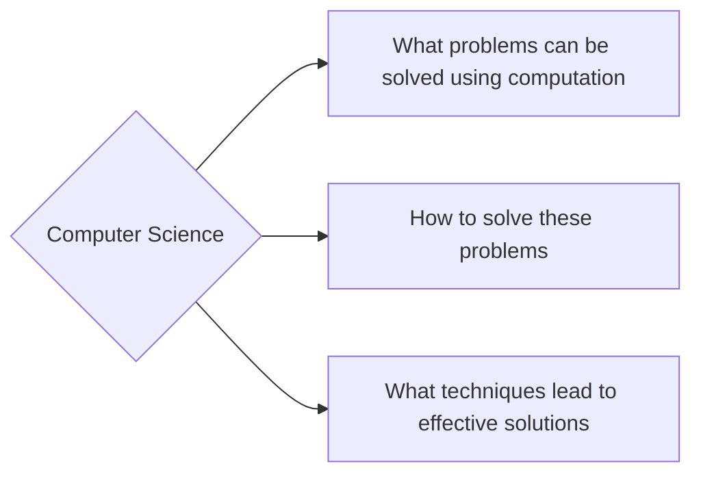

# Computer Science

---

Tags: #computerscience #programming #

---

A definition:
I believe the very top level definition of computer science is "the science of solving problems."
This is typically done with the help of tools such as software and computer programming.

A flowchart provided by BYU provides a good explanation of what exactly computer science is:

Ultimately, computer science is a catch all term.

Basically, programmers do the following:
- Manipulate values
- Create expressions
- Create abstractions

---

python looks at the *operator* first and then the *operands

**Pure Functions**:
Pure functions have no effects beyond returning a value. In addition, the same arguments must return the same value. As a result they are more reliable in complex nested statements, easier to test and debug, and they are essential for *concurrent* programs. 
**Non-Pure Functions**:
In addition to returning a value, a non-pure function has other side-effects such as printing something to the terminal.
## Related Topics:

