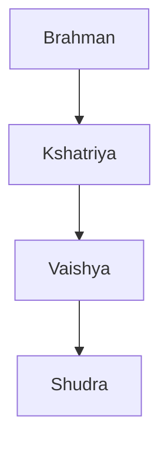

[[Human Origins and Agricultural Centers]]

# Agrarian-Urban Centers in India

---

---

### Geography

The region of India is very cut off from the rest of Eurasia. Surrounded by ocean on three sides and mountains on the fourth. 

The Indus river is slow with reliable overflows: better than the Tigris and Euphrates. It is very predictable. 
The agricultural system is influenced by annual monsoons and by the flooding of the Indus river. 

### Mehrgarh Culture (6000BC)

Raised wheat, barley, domesticated animals; had mud and brick structures.
Were semi-sedentary: every 10 years or so they would pick up and leave.
The oldest Neolithic site known in India; was a possible precursor to the Harappans.

---

### The Harappans (3000BC -1500BC)

Disappeared long ago.
Had an empire four times as large as Sargon the Great; two times larger than the Old Kingdom of Egypt. 
We know very little about this civilization, however. They disappeared from the historical record thousands of years ago. 

**The Region and People**:

Because of the flooding of the Indus River, cities were built on large artificial hills.
The two main cities, Harappa and Mohenjo-Daro are remarkably similar in design. The cities both had drains, uniform gridded streets, and similar layouts in buildings. 

There could possibly have been a kingdom, but we aren't sure if there were any social hierarchies; however, the bricks being uniform in size indicate that there was some authority calling the shots.

They had a very complex trade system with their merchandise being found as far as Egypt.
*Lothal* was a city that specialized in exporting beads for jewelry and was the primary Harappan seaport. 

The main cities:
- Harappa (40k population)
- Mohenjo-Daro
- Lothal

Around 1800 BC the cities were abandoned for unknown reasons. 

---

### Interactions in Northern India (1500BC-600BC)

Europeans who called themselves "Aryans" may have invaded India, but that is very much in doubt currently. 
It is still believed that Indo-European migrants, the *Vedas*, played a prominent role. This people were responsible for spreading many bronze age technologies. 

There was a very strict caste system:

The Vedas (religious hymns and epics) are our primary looking glass into the culture of early India.

They were excellent horsemen and weaponsmiths.

Rice was crucial in allowing for cities to be settled again, ending the more nomadic and village like life of the *Vedas*. The rice culture rose, requiring tedious, meticulous labor and a strong social organization. 

**Statecraft and the Ideology of Power** 

16 large states dominated the sub-continent. The four largest of these *mahajanapadas*, Avanti, Vatsa, Kosala, and Magadha, dominated. In their search for influence, they began to absorbed weaker neighbors and seek for power. 

Horse sacrifice, deemed the most sacred of sacrifices, became increasingly elaborate. 

The political situation became ever more tense between the states (*mahajanapadas*). Warfare became much more sophisticated.

The rulers wondered about the limitation of their rule and their purpose, resulting in the *Mahabharata*. The Mahabharata is a very long poem including stories of rulers, battles, and epics. In it we find much about the way rulers aught to operate. This tome defined stateship in India.

---

### Indian Society, Culture, and Religion (1500-600BC)

Dharma (duty in accordance with one's capabilities and requirements of one's place in society) drove much of Indian culture. 
Attributes intrinsic to farming were "found" in commoners, and Attributes intrinsic to service were "found" in servants, etc. 
It was one's duty to fulfil their Dharma in hope of a better life in the rebirth. 

The male householder was responsible for feeding everyone else in his home before himself.
The role of women is complex. The role of woman is to be housemaker, a role worthy of worship. They were seen as a threat to fulfilling one's Dharma, however. Women were way to sexy: a distraction from what was seen as important. 

**Cultural Interactions**

Priests continued to gain influence by monopolizing ceremonies.

*Asceticism*: Renouncement of the material world to purify one's self.

They believed that their actions in this life would determine in which caste they would be rebirthed into. *Karma-Samsara*.

---

### Recap

The Harappans, a society with intricate, beautiful cities, seemingly abandoned them for unknown reasons. 

The next 1000 years were smaller nomadic and village dwelling life.

An intricate social caste system, the Dharma, rose up, leading to Budahism. 