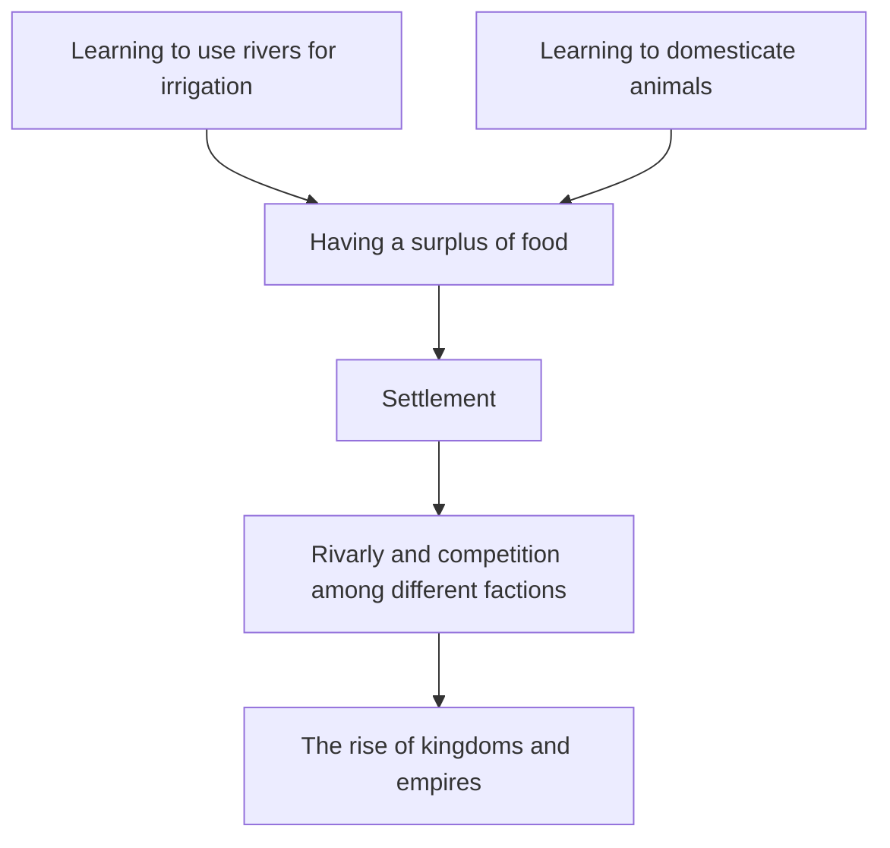

[[Human Origins and Agricultural Centers|Back to Human Origins and Agricultural Centers]]

# Agrarian-Urban Centers of the Middle East and Eastern Mediterranean

---

Tags: #history/ancient

---

### Agrarian Origins in the Fertile Crescent

The Middle East was favored by fertile soil, the rivers, the climate, and the animals. It was an excellent farming location, and Agrarian-Urban societies established themselves there about 3000 years ago.

Four smaller regions in the Middle East at the time:
- Persia to the east
- Mesopotamia: "The land between the rivers"
- Arabian Peninsula
- Afghanistan to the far east

>Agrarian Society: People engaged in farming cereal grains on rain-fed or irrigated fields and breeding sheep or cattle

**The Natufians**:
The Natufians were inhabitants in the Fertile Crescent who lived in semi-permanent settlements.
When they died, their relatives would take their skull and put it in a shrine.
They were foragers, not farmers until a cold, dry spell hit. They started to store grain, planting it in the spring. This marked the beginning of the *Neolithic* Age, where stone tools were used for agriculture. 

Villages began to expand rapidly. Humans began selectively breeding grain and animals (including horses).

###### The Origin of Urban Centers in Mesopotamia and Egypt

When the climate dried up, and the summer monsoons stopped coming, people moved to Mesopotamia to farm. Every spring the rivers would flood, resulting in a plethora of benefits. The same deal with the Nile in Egypt.

Towns developed in Mesopotamia and Northern Egypt, but always next to a river. The farmers who grew the most grain were the first *wealthy* peoples. They were able to buy land, hire *sharecroppers*, and outsource toolmaking and other specialties to craftsmen. Trade was flourishing. The *Chalcolithic*, or copper age, had officially begun with the workmanship of copper.

*Uruk*, founded around 4300 BCE in Mesopotamia, was the first city to be established that we know of. Rather than producing their own food like a town would, a city relied on trading their craftmanship. The leader, probably a land-owning priest, had a police force to keep the peace. 

The plow was invented, as was the wheel and carts. The potter's wheel was discovered, allowing for easier pottery. The first alloy, bronze, was invaluable to the society. The ***Bronze*** age had begun. 

Writing allowed for easier administrative purposes. Incidentally, it also allows for history to be better kept. 

###### Kingdoms in Mesopotamia, Egypt, and Crete

**Mesopotamia**:
As cities grew, they began to have border disputes. Walls were built, armies were recruited, and military leaders gained power. Leaders were elected. Leaders became kings. Kings became dynasties. The kings, to help establish their rule, claimed to be divinely appointed. 

Babylonia was the first kingdom to have established written down laws, called the Hammurabi. These laws indicate that early society had an understanding of justice. These laws were weighted to be proportionate between the crime and the punishment. An eye for an eye, etc. Prior to this, towns would typically just deliberate about punishments. 

Sargon "the Great" of the Akkadian Empire was the first king known to establish an empire. He ruled over about 2 million people. 

**Egypt**:
Egypt's Early Dynastic period was focused on uniting Egypt. The kings claimed divine heritage. Khufu was the first king of Egypt to order the construction of a pyramid. Kings already had claim to people's labor.

**Minoan**:
Sea-farers spread the practice of farming to Greece. The Minoan kingdom was a palace state, or a palace surrounded by villages and towns. They were skilled boat builders.

---

### Interactions Among Multiethnic and Multireligious Empires
Iron was developed as well as the composite bow. Combat began to go beyond simple food soldiers. The first empire that was able to utilize iron was the Hittite Empire. Based on a mining heavy economy, they were able to use their access to iron to conquer much of the Middle East. It is here we see the first "king of kings". The Hittite king, after defeating a kingdom, would allow the current king to stay in place as long as he submitted to the Hittite king.

Chariot warfare was a major factor in combat at this time. 

As a result of the Hittite empire growing closer to their border, Egypt adopted chariot warfare and engaged in ware with the Hittite people. This ware lasted until Egypt pushed the border into northern Syria when both sides adopted a peace treaty. Chariot war fare was deemed too expensive. 

The peace lasted until a group of people from the Greece region invaded. The Hittite empire collapsed and the Egyptians were pushed south into their homeland. The bronze age collapsed, and the iron age began. 

The Assyrian Empire: after an initial expansion and contraction of their territory, began invading neighboring lands like no one had done before. Eventually, they became the first empire to unify the entire Middle East.

**Smaller Civilizations of the Iron Age:**
- Phoenicians: Also known as the Canaanites, these peoples were primarily traders. Taking advantage of the collapse of the Hittite empire, the Phoenicians were able to establish trade outposts all across the land. This people was the ancestor to all alphabetical languages, having created the first instance of one. 
- Pelesets and Israelites: The Israelites fought for their freedom against the Pelesets. After winning their freedom, their reign did not last long before Babylon invaded.
- Mycenaeans and Early Greeks: Farming towns and trading forts transformed into Mycanaean palace-states. After these palace-states collapsed, the Greece city states rose up. These city states were independent from each other, and many of them developed a more democratic or republic form. 

---

### Religious and Cultural Achievements

Humanity began to associate natural forces with deities, resulting in polytheism. 
Rather than naturalism, the rise of Urban life preferred polytheism. This transition occurred for several reasons, one of them being that kings associated themselves with a god. At this time, Egypt had the most elaborate, structured pantheon.

These cultures had various religious texts, sculptures, and paintings

Mathematical understanding began early in human civilization. Addition and Subtraction were developed before written language was. 
Soon after writing was discovered, scribes made tables for multiplication, division, squares, cubes, square roots, cube roots, and reciprocal and exponential functions. 
The 60-degrees system for arcs, angles, and time are all systems we utilize today.

---

### Recap

The irrigational surpluses in the Middle East resulted in the rise of villages, towns, cities, and eventually, kingdoms. The rulers, wishing to retain their authority, appealed to the gods. The rulers became figures imbued with divine authority. 

Important to recall:
- Social hierarchies
- Gender roles
- Craft specialization and advancement
- Religion (naturalism to polytheism)
- Divine rulers
- Writing systems
- Laws
- Math, medicine, sciences, etc.
