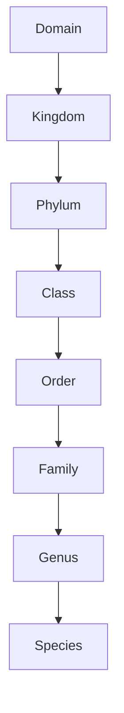

[[Header Pages/Biology|Back to Biology]]

# Biological Classification

---

Tags: #Biology 

---

## Biological Classification

###### Taxonomy:
- The art of naming organisms

###### Phylogeny:
- Classification based on evolutionary history

###### Systematics
- Discovering Those evolutionary relationships

###### Clade
- "Family Tree" of related organisms

---

## Hierarchy:

#### Domain:
- The largest group
- Example: Eukarya (Eukaryotes)

#### Kingdom
- The next largest group
- Example: Plantae (Plants)

#### Phylum:
- The next largest group
- Example: Echinodermata (Spiny outer covering)

#### Class:
- The next largest group
- Example: Aves (birds)

#### Order:
- The next largest group
- Example: Lepidoptera (butterflies)

#### Family:
- The next largest group
- Example: Gekkonidae (Geckos)

#### Genus:
- The second to smallest group
- Example: *Sceloporus*

#### Species:
- The smallest group
- Example: *sapiens*

---
---

## Classification

How do we decide where to catorgize organisms?

###### Homologous Structures:
- Similar Structures show similar evolutionary history
- Even when similar structures have different functions