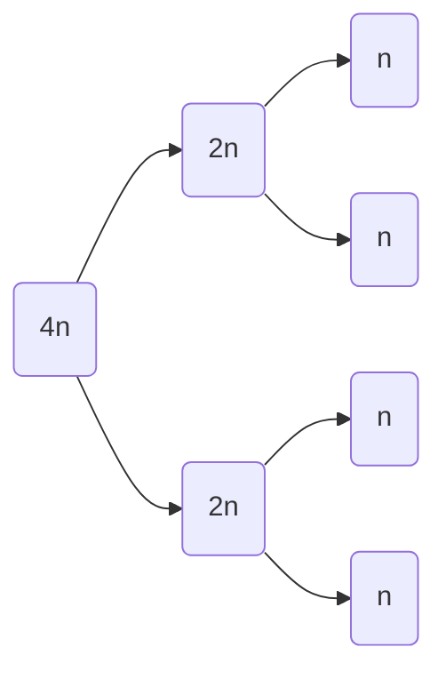

[[Header Pages/Biology|Back to Biology]]

# Cell Reproduction

---

Tags: #Biology 

---

## Cells

###### Why Grow Cells:
The body has a need for more cells:
- Replace normal wear and tear
- Replace senescence (growing old)
- Renewal and repair

###### 
"Daughter" cells need all the heredity information as the "parent" cell 
Growth and development: get bigger, stronger, faster, etc.

Sexual and asexual reproduction

###### Stem Cell:
- Self renewal and differentiation
- A Blank Slate; can become any type of cell
- Capable of dividing/renewing for long periods of time
- Unspecialized
- Can give rise to specialized cell types
- Found in embryos and some in adults
- Human embryonic stem cells:
	- From *in vitro* fertilizations that were donated with consent
- Induced pluripotent stem cells:
	- Specialized adult cells that can be "re-programmed" to another function

###### Other Dividing Cells:
- Liver cells will only divide into liver cells, etc.
- A cell can only make more of the same type
- Permanently differentiated cell:
	- Cardiac muscle cells and brain cells normally do not divide
	- New research is challenging this
	- Can lay dormant for a time, then become "activated"

---
---

## Chromosome Arrangement

#### Prokaryote Cells:

###### Chromosome:
- Only have one, circular chromosome
- Chromosome is attached to the cell membrane
- DNA in chromosome replicates
- Two chromosomes separate and move apart
- New membrane added
- Cleavage in between
- Two new daughter cells

![[Pasted image 20230208124614.png|400x350]]

---

#### Eukaryotic Cells:

###### Chromosome Organization:
- Folded, spiraled, compacted to fit within a nucleus
- Gene:
	- Lengths of DNA that code for a trait
- Locus:
	- Geographical location on the chromosome of a gene
- Telomere:
	- "End" signal for the chromosome
	- Located at each end of the chromosome
- Centromere:
	- Chromosome movement
	- Close to the center of the chromosome
	- Important for when DNA starts to divide

###### Duplicated Chromosome
- Chromosome DNA is replicated
- Comprised of two sister chromatids

###### Sister Chromatids:
- Two identical DNA spirals connected at the centromere

###### Homologues:
- Chromosomes that contain the same genes
- Not necessarily the exact same DNA
- Humans have 23 homologues (pairs) == 46 chromosomes

###### Diploid:
- Somatic cells that have pairs of homologous chromosomes 
- 2n 

###### Haploid:
- Half or only one type of each chromosomes
- 1n
- Gametes (sperm and egg) have 1 copy of each pair of chromosomes
- In humans one each of 22 chromosomes and an X or a Y
- When fertilization takes place: 1n + 1n = 2n

###### Sex Chromosomes:
- XX for female
- XY for male

---
---

## Cell Reproduction

#### Mitosis

###### Interphase
- Acquires nutrients
- grows and differentiates
- Prepares for division 
- Doubles *everything*
- **G1**:
	- Growth and differentiation
- **S**:
	- DNA Synthesis
- **G2**:
	- Growth and division prep
	- Doubles organelles

###### Prophase:
- Chromosomes condense
	- Wind up into our familiar gummy worm shape
- Spindle Forms
- Nucleolus disappears
- Nuclear membrane dissolves
- Kinetochore holds chromosomes to spindle

###### Metaphase
- Kinetochores (hold the chromosomes) line up on the equator
- The nuclear membrane is still dissolved

###### Anaphase
- Sister chromatids separate
	- Spindle pulls them apart
	- They move to opposite poles

###### Telophase
- Chromosomes decondense
	- Become spaghetti once more
- The nuclear envelope starts to re-form
- Spindle disappears
- Cell begins to pinch off (doesn't complete the process)

###### Cytokinesis
- Microfilaments contracts
- Each "daughter" cell has 1 nucleus and 1/2 of the cytoplasm
- The cell returns to Interphase

---

#### Meiosis

Each daughter cell has 1 member of homologous pair

Cuts the number of chromosomes in half

**Sperm/Egg has 23 chromosomes, not 23 pairs**

Keeps the chromosome number constant.

#### Meiosis 1
- **Prophase 1**
	- Duplicated chromosomes condense into gummy worms
	- Homologues pair up and cross over
		- "Switch" genes
		- Increases variations
		- Totally random
	- Nuclear envelope disappears
	- Spindle forms
- **Metaphase 1:**
	- Paired homologues line up on the equator
	- Kinetochores attach to the spindle
- **Anaphase 1:**
	- Homologues separate and move to opposite poles
	- **Sister Chromatids stay together!**
- **Telophase**:
	- Spindle disappears
	- Cytokinesis follows
	- Microfilaments contract, pinching the cell into two

#### Meiosis 2
- **Prophase 2**:
	- Chromosomes recondense
	- Attached to spindle by kinetochore
- **Metaphase 2**:
	- Chromosomes attached to spindle by kinetochore
	- Chromosomes line up on the equator
- **Anaphase 2**:
	- Chromatids separate
	- Move to opposite poles
- **Telophase 2**:
	- Begins to pinch in until you achieve full separation
	- Nuclear membrane begins to reform
	- Spindle disintegrates
	
#### Results:
- 4 haploid (n) gametes
- 1 Member of each pair of homologues

---
---

## Review

#### Mitosis
- Purpose:
	- Make more cells for several reasons
- Location:
	- Everywhere but in gamete-producing organs (sperm and eggs)
- How many chromosomes in Humans:
	- 23 homologous pairs
	- 46 chromosomes
	- 23 chromosomes from Mom and 23 chromosomes from Dad
- 