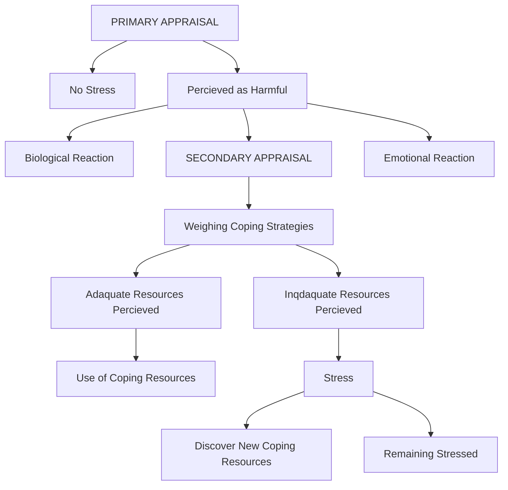

[[Psychology]]

# Personality

---

Tags: #psychology 

---

Personality is defined as the unique and relatively stable way in which an individual thinks, acts, and feels.

## Psychodynamic Perspectives

### Freud's Conception of Personality

**Structure of the Mind**:
- Believed the mind was divided into three parts:
	- Preconscious (memories and information)
	- Conscious (one's awareness)
	- Unconscious (hidden part of the mind)
- Believed that personality was divided into three parts:
	-  ego
	- superego
	- id
- These three parts interacted with each other to result in personality
- The tension and anxiety resulting from these interactions results in *Psychological defense mechanisms*, redirecting the anxiety into another form

**Id**:
- Completely unconscious
- Pleasure-seeking (pleasure principle)
	-  "If it feels good, do it"
- Amoral
- Contains all the basic biological drives

**Ego**:
- Mostly conscious
- Rational, logical, and cunning
- Works on the *reality principle* 
	- The need to satisfy the demands of the id only in ways that don't lead to negative consequences
	- "If it feels good, do it, but only if you can get away with it"
- Develops after the id cannot deal with the reality

**Superego**:
- Moral center of personality
- Contains the conscience
- The sense of right and wrong

### Freud's Stages of Personality Development

Five psychosexual stages of personality development, each focusing on a different *erogenous zone* that can become the source of conflicts. 

**Oral Stage (First 18 Months)**:
- Focuses on the mouth
- The conflict during this stage is weaning children away from the mother's breast.
- Weaning too soon or too late results in traits associated with an orally fixated adult personality:
	- Overeating, heavy drinking, chain smoking
	- Talking too much
	- Nail biting, chewing gum

**Anal Stage (18-36 Months):**
- Believed that children get a great deal of pleasure from withholding and releasing their feces
- Main conflict was toilet training
- Harsh training results in an adult with *anal expulsive personality* or *anal retentive personality*:
- *Anal expulsive personality*:
	- Sees messiness as a statement of control
	- Destructive and hostile
- *Anal retentive personality*:
	- Stingy and stubborn
	- Excessively neat

**Phallic Stage (3-6 Years):**
- Believed that the erogenous zone shifts to the genitals
- Children have discovered the differences between the sexes
- Believed that most had engaged in self-stimulation of the genitals
- Boys develop a fear of losing their penis, *castration anxiety*, while girls developed *penis envy*
- Freud believed that boys developed sexual attraction to their mothers and jealousy of their fathers
	- Leads to a *repression* of his sexual feelings for his mother and *identification* with his father (psychological defense mechanisms) out of fear of his father's wrath
	- Girls go though *Electra Complex* where they are competing with their mothers for their father's attention
- If a child doesn't have a same-sex parent or the opposite-sex parent encourages the attraction, fixation occurs
	- Exhibit promiscuous sexual behavior
	- Vain
	- Men never grow up, and women look for older men to marry

**Latency Stage (6 Years to Puberty):**
- Children have repressed their sexual feelings
- Children grow and develop intellectually, physically, and socially

**Genital Stage (Puberty On)**:
- Sexual feelings can no longer be ignored
- Sexual focus on other adolescents, celebrities, etc. Not parents
- The entry into adult social and sexual behavior

---

### The Neo-Freudians

A number of psychoanalysts broke away from Freud's views on biology and sexuality to develop their own perspectives on personality.
They gained their fame by breaking away from Freud.

**Jung**:
- Disagreed with Freud about the nature of the unconscious mind
- Believed it held more than fears, urges, and memories
- Contains species memories called *archetypes*
	- Anima/animus: feminine side of a man/masculine side of a woman
	- Shadow: the dark side of personality
- Side of one's personality shown to the world called the *persona*

**Adler**:
- Disagreed with Freud's belief of the importance of sexuality in personality development
- As children, we develop feelings of inferiority when comparing ourselves with the adults in our lives
- The driving force in personality development was the search for superiority 
- Believed birth order mattered in personality development
	- First born became over-achievers
	- Middle-born became competitive
	- Younger children feel inferior

**Horney**:
- A pioneer in feminist psychology
- Believed that men have womb-envy
- Challenged Freud's views on psychoanalysis, believing it to be male-focused 
- Focused on the basic anxiety children feel in a world more powerful than they are
	- Love, affection, and security can overcome this anxiety
	- Some children cope by becoming dependent and clingy, others by becoming aggressive and cruel

**Erikson**:
- Emphasized social relationships in personality development

---
---

## Behavioral and Social Cognitive Perspectives

Personality is nothing more than a set of learned responses or habits.

### Bandura's Reciprocal Determinism and Self-Efficacy

**Reciprocal Determinism**:
- Believed that three factors influence each other in determining personality:
	- The environment
	- The behavior
	- Personal/cognitive factors
- Depending on the environment, someone will have a different personality
- Feedback from the behavior determines the likelihood of repeating it

![[uvp1ahx4.bmp|300]]

**Self-Efficacy**:
- A person's belief of how effective their efforts will be 
- Affected by attempts in the past

---

### Rotter's Social Learning Theory

**Views on Personality**:
- Personality a set of potential responses to situations
- Past experiences mold and reform the set to try and achieve the best outcome

**Lotus of Control**:
- The tendency for people to assume that they either have control or don't have it
- Those who assume that their actions directly affect the consequences are *internal*
- Those who assume that their lives are controlled by other factors are *external*

---
---

## Humanistic Perspective

### Maslow and Rogers' View on Personality

**Real and Ideal Self**:
- Real self is who you are, and Ideal self is who you want to be
- When the real self and the ideal self are similar, we feel competent and capable
- When there is discord, anxiety and neurotic behavior is the result
- More likely to match if they aren't that different from the start
	- Have a realistic view of the self
	- Have an attainable ideal self

**Positive Regard**:
- The warmth, affection, love, and respect that come from those in our lives
- Unconditional positive regard:
	- Positive regard with no strings attached
	- Necessary for people to become self-actualized and fully functioning
- Conditional positive regard:
	- Positive regard that depend on the decisions you make

---
---

## The Trait Perspective

Less concerned with the explanation for personality development than describing personality and predicting behavior.

A trait is a consistent way of thinking, feeling, or behaving.

Is it stable across time and situation.

**Trait Theory of Personality**:
Trait view:
- We think and behave consistently across situations
Situation View:
- Our thoughts and behaviors change with the situation
Interactionist View:
- Both traits and situations affect thoughts and behaviors

### Allport and Cattell

**Surface and Source Traits**:
- Allport scanned the dictionary and found 4500 traits
- After eliminating synonyms, Allport was left with 200 traits. 
- Cattell defined two traits: Surface Traits and Source Traits
	- Surface Traits: Represent personality characteristics easily seen by others
	- Source Traits: Basic traits that underlie the surface traits
- Cattell identified 16 source traits using *Factor Analysis*

**The Big Five (OCEAN)**:
- Cattell's 16 traits can be further reduced down to 5
	- Openness (O)
		- A person's willingness to try new things
	- Conscientiousness (C)
		- Level of organization and motivation
	- Extraversion (E)
		- How outgoing and sociable one is
	- Agreeableness (A)
		- Basic emotional style: easygoing or hard to get along with
	- Neuroticism (N)
		- Emotional instability or stability

---
---

## The Biological Perspective

### Hereditary Influence

**Twin Studies**:
- Twin studies have shown that at some level heredity influences our personality
- 25%-50% of the big five traits can be predicted by heredity

**Adoption Studies**:
- Confirms findings of twin studies
- A genetic basis has been suggested for inhibition and aggression. 

### Neuroscience

**Phrenology**:
- German physician suggested that personality traits were based on the shape of someone's skull
- Certain areas of the brain responsible for aspects of personality
- Skull would bulge in areas that were dominant

**Areas of the Brain and Their Traits**:
- Extraversion:
	- Associated with higher volume in medial orbitofrontal cortex
	- Recognized with recognizing the value of rewarding information
	- Amygdala also appears to be associated
- Neuroticism:
	- Associated with lower brain volumes in brain areas responding to threat, punishment, and other negative emotions
	- Associated with higher brain volumes in brain areas linked with error detection and response to pain
	- Amygdala also appears to be associated
- Agreeableness:
	- Associated with areas of the brain associated with the intentions of actions and mental states of others
- Conscientiousness:
	- Associated with an area of the brain involved in planning, working memory, and control of behavior
- Openness:
	- Mixed findings
	- Still being researched

---
---

## Stress

### Cognitive Factors

**Lazarus's View of Stress**:

- Primary Appraisal:
	- Estimating the severity of the stressor
	- Classifying the stressor as a threat
- Secondary Appraisal:
	- Occurs when a threat is identified
	- Estimate the resources they have available for coping with the stressor
	- When it is perceived that there are enough resources, the stress is less

---

### Personality Factors

The way one cognitively assesses a stressor has a great deal with their personality.
There are several different personality types that we can use to predict how one deals with stress.

**Type A**:
- Workaholics
- Very competitive and ambitious
- Hate wasting time
- Easily annoyed
- Tend to do several things at once
- Prone to heart disease

**Type B**:
- Not that competitive or driven
- Easygoing and relaxed
- Slow to anger

**Type C**:
- Associated with a higher incidence of cancer
- Very pleasant
- Peacekeepers
- Difficulty expressing emotion, especially negative ones
- Internalize anger
- Lonely

**Type D**:
- Prone to chronic stress
- Experience negative emotions
- Experience social inhibition

**Type H**:
- The Hardy Personality
- Similar to Type A, but without the risk of heart disease
- Thrive on stress
- Deep sense of commitment to their values
- Feel like they are in control of their lives
- Instead of seeing a frightening problem, they see a challenge

---
---

## Personality Assessment

### Behavioral Assessments

**Direct Observation**:
- Observe the subject engaging in ordinary behavior
- Preferably in their natural environment
- Use observed behavior to make conclusions about personality

**Rating Scale**:
- A numerical rating is assigned for specific behaviors
- Can be from either subject or the assessor

**Frequency Count**:
- Counts the frequency of certain behaviors within a time limit

---

### Interviews

Assessor asks questions and notes the answers.

---

### Personality Inventories

A questionnaire that has a list of questions that require specific answers such as "yes" and "no".
The questions are standardized.
Far more objective and reliable than projective tests.
They have the advantage of being very easy to statistically analyze.

**Factors of a Good Test**:
- Validity:
	- Test measures what it is supposed to
	- Part of this is standardization. The test cannot be accurate if it is not standardized.
- Reliability:
	- Test is consistent in its nature

**MMPI-2-RF**:
- Tests for abnormal behavior and thinking patterns
- 338 statements
- Contains 12 higher-order and clinical scales, 10 validity scales, and other scales for specific problems
	- Each scale tests for a kind of behavior or way of thinking
	- Contains mild to severe traits
- Often used in job screening
- Contains *Validity Scales*:
	- Indicate whether a person is responding honestly
	- Indicate whether people are trying to make themselves look better or worse

**Sensation Seeking Test**:
- Sample individuals that snowboard, sky dive, etc.
- If the test is *valid*, the individuals should have high scores for sensation seeking

**Cloninger Temperament and Character Inventory Test**:
- Based on underlying biochemical profiles
- High/low Serotonin, norepinephrine, dopamine, oxytocin
- Developed by Helen Fishier
	- Worked with Match.com to develop algorithms for whether people were compatible
- Traits include:
	- Self Transcendence
		- High spiritual, unpretentious, humble and fulfilled 
		- Low results in practical
		- 
---

### Projective Tests

Show subjects ambiguous visual stimuli and ask them to interpret it.
Used to explore personality and uncover problems in personality.
However, they are very subjective in nature.
Have issues with *reliability* and *validity*.

**Rorschach Inkblots**:
- 10 inkblots:
	- 5 in black on white
	- 5 in color on white

![[e4jgn449.bmp|150]]

- Subjects are shown the inkblot and asked to say what it looks like
- Controversial due to concerns about scoring methods

**TAT**:
- Consists of 20 ambiguous pictures
- Subject asked to tell a story about the person.

---
---

## Optimism vs. Pessimism

There is a correlation between levels of perceived stress and telomere length and action of telomerase.

---
---

## Introversion vs. Extraversion

Julianne Holt-Lunstad: health psychology
- Loneliness matters
- Similar to smoking 15 cigarettes a day
- Risk of death surpasses risk posed by obesity
- Marriage is protective

---
---

## Is Aggression a Trait

Children measured to have high levels of aggression measured to have high levels of aggression later in their lives.
This shows that aggression is stable across time and across different situations.

Aggression is as stable as IQ.

Source traits:
- Norepinephrine (increases heart rate). Hot heads
- Serotonin (impulsive aggression)
- Type A Personality

Low or impaired CNS serotonin is found in people who are violent. 

Difficulty controlling your temper can delay healing.