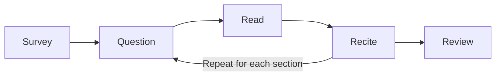

# Revel Scholarly Habits

---

tags: #productivity #studying, #habits

---

## Study Skills

Types of studying:
- Verbal: saying or writing information
- Visual: creating a visual representation of information
- Auditory: listening to information
- Action: performing physical movements to recall information

---

## Time/Task Management

It can be difficult to properly manage your time and tasks. 
Some ways to allow for better time management
- Write down what you want to achieve with the course
- Schedule out time utilizing a calendar/schedule to keep track of all assignments, lectures, social engagements, papers, etc.
- Make a plan for the next day. Prioritize tasks in order of importance. Block out *when* you are going to work on a specific task
- Create plans for larger tasks; break them down into smaller, more manageable chunks
- Do the small stuff in down time. It will add up
- Having a consistent, restful sleep cycle is important to cognitive function
- Don't worry if you go off schedule. There's always tomorrow

Try not to multitask. Dividing your attention rarely works out the way you intend it to. This has been clinically proven.

The GSD method: 
- Record everything that you need to do into one spot. A todo list, for instance.
- Create detailed plans on how to complete your todo list. Split complex tasks down into simpler elements.
- Categorize your tasks into similar groups so as to not break your flow.
- Stay on top of what you need to do. Frequently review your projects and actions.
- Be aware of the time frames for each task. Be smart in the order you complete them.

---

## Reading Textbooks

It is important to read the textbook before the lecture. This will allow you to follow the lecture and will further cement the concepts in your mind.

Don't try to cram in the entire chapter. Rather, you need to read slowly to capture all the details.

One of the best known methods for reading textbooks is the SQ3R method.

#### Survey:
Skim through the textbook. Form a mental framework for the chapter; what is it going to cover? What are you going to learn?

#### Question:
After reading the heading for the first section, ask a question that it will answer. Don't just *read* the text, read to *find an answer*.

#### Read
You are finally ready to read the section, taking notes as you do so. It is important to write notes *in your own words*. If you are unable to recite what you read in a unique way, you do not understand it.

#### Recite
Repeating what you write down stores it in your auditory memory as well as your visual. The rubber ducky method is very powerful. 

#### Review/Recall
Take a look at what you just studied. If you have access to a practice test, take it. Look back at the sections relating to the questions you miss until you have a complete understanding of the topic. Alternatively, you can read through the textbook and go back to any section you find confusing.


---

#### Lectures

Lectures allow you to flush out and further review your notes on the chapter.

Don't just record the PowerPoint slides: write down *everything* important, not just the talking points.

---

#### Exams

Do ***NOT*** wait until the last minute to study for an exam. Spread out your studying for the maximum retention. By thoroughly reading the textbook, you should only have to review your notes; you will need ample time to do so.

Get all the information you can about the test. Looking at old tests can be helpful. 

The types of questions found on tests:
- Factual: These ask you about a specific fact
- Applied: For these you must *apply* the information you have learned
- Conceptual: You must understand the *concepts* themselves for these questions

Memorization might work well for the first question, but is almost useless for the rest. The SQ3R method works well on your notes. Take a look at some concept maps. If you have access to review material or other resources, utilize them.

Sleep is important too. So is food. Be careful with your time, but don't skip out on the bare necessities. 

---

#### Improving Your Memory

Mnemonic devices can be helpful for recalling information.
Some devices include:
- Linking: A linked list of data points, each one pointing to the next.
	 ```mermaid
	graph LR;
	A[Item 1];
	B[Item 2];
	C[Item 3];
	D[Item 4];
	E[Item 5];
	
	A-->B;
	B-->C;
	C-->D;
	D-->E;
	```
* Peg-Word: Using a list of numbered words that can be used as a key for the items associated with them. For example:
	* One is a bun.
	* Two is a shoe.
	* Three is a tree, etc.
* Loci(Memory Palace): Create a house inside of your mind. Associate each room with something you are trying to remember. When you want to recall that information, simply walk through your *mind palace*. Very similar to the Linking method.
* Verbal/Rhythmic: Create a cute rhyme or tune. It helps quite a bit. Most of us learned the alphabet this way.

---

#### Writing Papers

The process:
* Choose the topic. Try to not to pick a topic that is too broad: narrow it down.
* Research the topic. By finding as many sources as you can, you make it easier to write longer. You gain more ideas that you can play of off, and as an additional bonus, you can pad the essay with quotes!
* As you research, take notes. Remember to write the reference that goes with the reading.
* Come up with your thesis. What's the purpose? What are you trying to convey? What is important?
* Sketch the outline out. The more detailed the better, yet be careful not to get into the nitty gritty.
* Write your first draft. With your trusty outline and notes, it shouldn't be terribly difficult. Remember: it is better to have a crappy first draft than no paper at all.
* Take a vacation. Fresh eyes will reveal everything that you need to revise. Repeat this step for as long as you have time. 
* Revise. You have your unfinished product, it is time to refine it. 

---

#### Cheating

It is not worth it to cheat. In addition, you need to make sure to cite **everything**. Be *incredibly* careful when writing papers. A missed citation could lead to serious consequences. 


Some tools to prevent yourself from plagiarizing:
- turnitin.com/resources
- grammarly.com/plagiarism-checker
- owl.purdue.edu/owl/purdue_owl.html
- wts.indiana.edu/writing-guides/plagiarism.html
- accreditedschoolsonline.org/resources/preventing-plagiarism

I would recommend running your paper through before submitting.

---

### Ways Psychology 111 is set up for me:
1. Access to TAs who can help me with any questions I might have.
2. I have access to the revel textbook which includes many helpful digital tools such as audio.
3. I got access to the textbook for a very good price. 
4. A good 92.5% for an A. That is pretty generous.
5. Drops lowest scores at the end of the semester
6. A lot of points in the grading scale. Making a mistake doesn't have to tank my grade.
7. Quizzes make a fair proportion of the grade