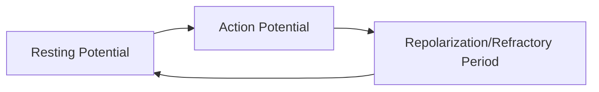
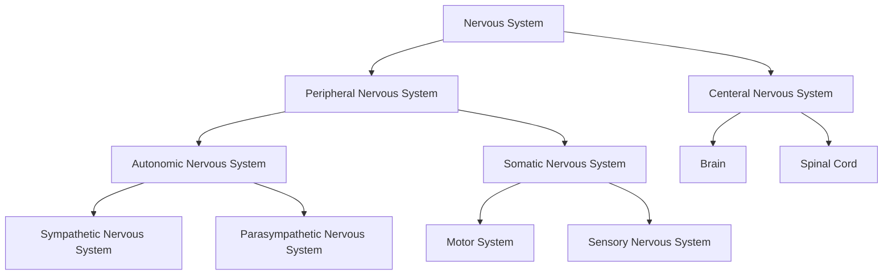

[[Psychology | Back to Psychology]]

# The Biological Perspective

---

Tags: #Psychology #Biology

---

The brain is very influential on our behavior. It controls our entire body:
- Motion
- Fear
- Emotion
- Personality
The brain does this by secreting chemicals and hormones, sending nervous signals, etc.
The brain is the key to understanding much of our psychology, and is the most complex thing we have discovered in the universe. 

It weights about three pounds, but it uses 30% of the glucose, 25% of the oxygen, 25% of the nutrients, and 1.5 pints/min of blood out of our *entire* body*.

We start out with 100 billion neurons, but we lose roughly 200,000 neurons per day. 

Biological psychology, or behavioral neuroscience, focusses on the biological bases of psychology.

---

### Neurons and Neurotransmitters

Neurons are the basic unit.
Nerves are bundles of axons that travel together.

>Nervous system: a network of cells that carries information to and from all parts of the body.

Two types of neurons: 
- Afferent (Sensory neuron)
- Efferent (Motor neuron)
- Interneuron (relay between)

#testmaterial 
There are five structures that make up many neurons:
1. Dendrites: receive signals from other cells. They are attached to the cell body
2. Soma: contains the nucleus and keeps the cell alive and functioning. Integrates signals from multiple dendrites
3. Axon: carries the signals from the soma to the other end of the neuron
	- Axon hillock: bridges the axon and the soma
4. Myelin Sheath: insulates the axon, speeding the transmission
5. Axon Terminals: Releases neurotransmitters that communicate with other cells and neurons.

#testmaterial
![[0sob29pk.bmp]]

**Glial Cells**:

The other primary cell is the glial cells (glia). The glia help clean up after and support the neurons. Myelin is produced from special types of glial cells, which is used to protect the nervous system. The "skeleton" of the brain

#testmaterial
Micro Glial: Collects garbage (dead neurons and extra neurotransmitters) and invaders
Oligodendrocyte: Makes the myelin sheath in the brain
Schwan Cells: Makes the myelin sheath outside the brain

Nodes connect strands of the axon and are *not* protected by the myelin sheath, giving it the appearance of a strand of sausages. 

**Resting Potential**:
#testmaterial
When neuron is at rest, it is electrically charged by the ions inside a semiliquid solution inside the cell. There are large negatively charged protein ions that are too large to diffuse inside, leaving the cell negatively charged. Positively charged sodium ions wait outside of the neuron. When the ion channels open, the charge of the neuron reverses, becoming positive and releasing neurotransmitters. This is known as the neuron's *action potential*. Neurons are binary; they are transmitting a signal or they are not. All or nothing, meaning there is a brief recharge period.

During *action potential*, the charges switch. 

Sodium ions are positively charged
Potassium ions are negatively charged.

For every 3 sodium ions pumped out, 2 potassium ions are pumped in.

When *Repolarization* occurs, there is a *Refractory Period* where the negative charge overcompensates for the positive spike in charge. It overshoots the -70mV that resting potential sits at.

![[ojpvgbgh.bmp]]

**Diseases of the Brain**:
- Dementia: extreme loss of brain cells
	- Alzheimer's is a form of Dementia 
- Strokes: a blood clot blocks blood going to the brain.
- Neglect: neglect can also reduce brain size

**Neurotransmitters and Neuromodulators:**

Neurotransmitters are quite fast: get released and sucked back up quickly
Neuromodulators tend to hang out for a while, not quick.

The vesicles hold the neurotransmitters that are waiting to be used. 
They will also steal them back if they hang out to long in a process called *Reuptake*.

When neurotransmitters are released from the vesicles in the neuron, they cross a small fluid-filled space to the dendrites of other neurons. Neurons can either turn cells on (an *excitatory* effect) or turn them off (an *inhibitory* effect). It is the type of synapse (synaptic cleft) that determines which effect a neurotransmitter will have.

**Types of neurotransmitters:**

- Acetylcholine: Is the most abundant NT in the body; controls muscle contractions and attention **Excitatory**
- GABA: Involved in sleep and inhibits movement **Major Inhibitory**
- Serotonin: Regulates mood **Excitatory**
- Dopamine: Happy juice **Excitatory or Inhibitory**
- Glutamate: learning, memory formation, and nervous system development **Major Excitatory**
- Norepinephrine: control of movement and pleasure **Excitatory**
- Endorphins: pain relief **inhibitory**

**Two forms of chemicals:**
- Antagonist: a chemical that blocks or reduces the effects of a neurotransmitter
- Agonist: A chemical that enhances the effect of a neurotransmitter

**Neuromodulators/Hormones:**

Induce a change in the state of the neurons, leading them to become more or less active.
Diffuses throughout the body via the bloodstream.

- Controlled by the Pituitary Gland
- Oxytocin
	- Can act as both a neurotransmitter and a hormone
- Cortisol
	- Stress hormone
- Testosterone & Estrogen
	- Motivation, competition, mood, cognition.
	- Testosterone deals with the sex drive

**Reuptake**
Process where neurotransmitters are taken back into thy synaptic vesicles. 

---

### Studying the Brain

**Lesioning Studies**
One way to learn more about each part of the brain is to study organisms that have suffered damage to a specific part.
Lesioning is using electrical current to destroy a section of an animal's brain tissue.

**Brain Stimulation**:
Similar to lesioning, we can temporarily disrupt or enhance a specific area of the brain by using electrical stimulation. We can do this with invasive and non-invasive methods.

There are several ways of looking inside the brain:
- Computed Tomography (CT): takes a series of X-rays of the brain, and uses a computer to stitch them together. These can show stroke damage, tumors, injuries, and abnormal brain structure. 
- Magnetic Resonance Imaging (MRI): Uses magnetic fields to control hydrogen atoms in the brain tissue. 
	- Diffusion tensor imaging: A form of MRI that traces the myelinated matter tracks. 

To identify the functions of the brain:
- Electroencephalogram (EEG): sensors are placed at the base of the scalp, and we are able to read the electric signals to know what parts of the brain are being used
- Magnetoencephalography (MEG): Detects the magnetic fields generated by the electrical activity of the neurons. 
- Positron Emission Tomography (PET): Analyses the consumption of a radioactive glucose to calculate which parts of the brain are active. 
- Functional MRI (fMRI): Calculates blood oxygen consumption to calculate which parts of the brain are being used at a given time. 
- Near-Infrared Spectroscopy (NRIS): Uses near infrared light to calculate changes in the concentration of oxygen in blood cells. 

---

### The Structure of the Brain

| Term      | Meaning                     |
| --------- | --------------------------- |
| Anterior  | Towards the front           |
| Posterior | Towards the rear            |
| Superior  | Above                       |
| Inferior  | Below                       |
| Medial    | Towards the middle          |
| Lateral   | Away from the middle        |
| Ventral   | Towards the belly           |
| Dorsal    | Towards the top of the head |

![[4150id2i.bmp]]

*The Cortex*: 
- **Occipital Lobes**:
	- Processes visual information
- **Parietal Lobes**:
	- Processes information from the body; touch, temperature, and position. 
	- Attention and Daydreaming / plan execution
	- Spatial location
- **Temporal Lobes**: 
	- Processes auditory information
	- Enters new information as memory
	- Stores visual memories
	- Object recognition
	- Language Centers
	-  **Wernicke's Area**:
		- Involved in understanding words' meaning
- **Frontal Lobes:**:
	- Higher mental functions. Planning, personality, memory storage, decision making, and language. Also helps control emotions.
		- **Prefrontal Cortex**: Our ability to consider the future and control our current behavior as such.
		- **Motor cortex**: Controls voluntary movement.
	- **Broca's Area**:
		- Interacts with the different parts of the brain responsible for speech.

**The Hindbrain**

***The Medulla*:** 
The medulla is located at the top of the spinal column, at the very bottom of the brain. It controls life-sustaining functions such as your heartbeat, breathing, and swallowing. 

***The Pons***: 
The pons is located just above the medulla. It acts as the bridge between the cerebellum and the upper sections of the brain. It also influences sleep, dreaming, and arousal.

***The Reticular Formation (RF)***:
A network of neurons running through the center of the medulla, pons, and beyond. The RF allows people to ignore constant information and be aware of changes in information. It also helps keep us alert and aroused. When a danger presents itself, the RF brings us to full attention.

***The Cerebellum*:** 
At the base of the skull in the rear is the Cerebellum. The cerebellum (little brain) controls all the involuntary, fine motor, and rapid-fire movement. It also coordinates the voluntary movements that happen in rapid succession. This is where learned reflexes and habits are stored. 

**The Forebrain & Midbrain**:

The *Limbic System*:
- The limbic system is involved in emotions, memory, and learning
- ***The Thalamus***:
	- Processes the senses: hearing, sight, touch, and taste. Passes on the information to the cortex
- ***The Hypothalamus***:
	- Controls body temp, thirst, hunger, sleeping and waking, sexual activity, and emotions.
- ***The Hippocampus***: 
	- Forms long-term memories that are stored elsewhere. Shaped like a seahorse. HM's removed hippocampus made him *unable* to make new memories. 
- ***The Amygdala***: 
	- Involved in fear responses and memories of fear; inner feelings.
- ***The Cingulate Cortex***:
	- Plays a role in emotional and cognitive processing. 
- ***Corpus Callosum***:
	- Connects the left brain and the right brain
- ***The Basal Ganglia***:
	- Overlearned behaviors; habit formation; motivation

The Cerebral Cortex makes up the bulk of the human brain. It is essentially two brains "wired" together.

**The Strips**:
- ***The Sensory Strip***:
	- Controls sensory information
- ***The Motor Strip***
	- Controls motor function

---

### The Nervous System:

![[chu1n6j3.bmp]]

**The Central Nervous System**:

The spinal cord has built-in methods for certain reflexes. For example, if you burn your finger, the signal doesn't go all the way up to the brain first; rather, it will go to an *interneuron* that will send a signal to your hand to move. 
- Afferent Neurons carry signals from the senses to the spinal chord
- Efferent neurons carry signals from the spinal cord to the muscles and glands
- Interneurons connect the afferent neurons to the efferent neurons

**The Peripheral Nervous System**:
*The Somatic Nervous System*:
- *Sensory Pathway*: carries messages from the senses to the central nervous system
- *Motor Pathway*: carries messages from the central nervous system to the voluntary muscles of the body

*The Autonomic Nervous System*:
- Controls everything else in the body such as organs, glands, and involuntary muscles.
- The *Para-Sympathetic*/*Sympathetic* nervous system--Fight or flight: 
	- Heart pumps harder
	- Draws blood away from non-essential organs such as skin
	- Lungs work overtime

---

### The Endocrine Glands

Glands are organs that secrete chemicals.

**The Pituitary Gland**:
Located right underneath the brain and is connected to the hypothalamus. It is known as the *master gland* as it controls the other glands. It is the head hauncho. 

Releases growth hormones that control the increase in size of growing children. Is responsible for releasing sex hormones that influence sexual development. 
Hormones are extremely powerful in how they affect our lives. 

**The Pineal Gland**:
Secretes *melatonin* which allows us to track day length.

**The Thyroid Gland**:
Secretes hormones that regulate growth and metabolism.

**The Pancreas**:
Controls the blood sugar level in the body by secreting hormones called *insulin* and *glucagon*.

**The Gonads**:
The sex glands. Ovaries for females and testes for males. Secrete hormones that regulate sexual behavior.

**The Adrenal Glands**:
Secretes hormones when people are under stress and aids in sympathetic arousal.

When there is a stress, the body reacts in three phases:
1. Alarm: Hormones are released that increase your heart rate, blood pressure, and the suply of blood sugar. You get a burst of energy.
2. Resistance: The heightened stage continues until the stressor is gone or you are out of resources. 
3. Exhaustion: You have no more resources available to you.

Stress increases the activity of the immune system in the short term (as well as providing other benefits), but can be harmful if it lasts too long. 

Stress has been known to put people at a higher risk of:
- Coronary heart disease
- Diabetes 
- Cancer
- Fevers and colds