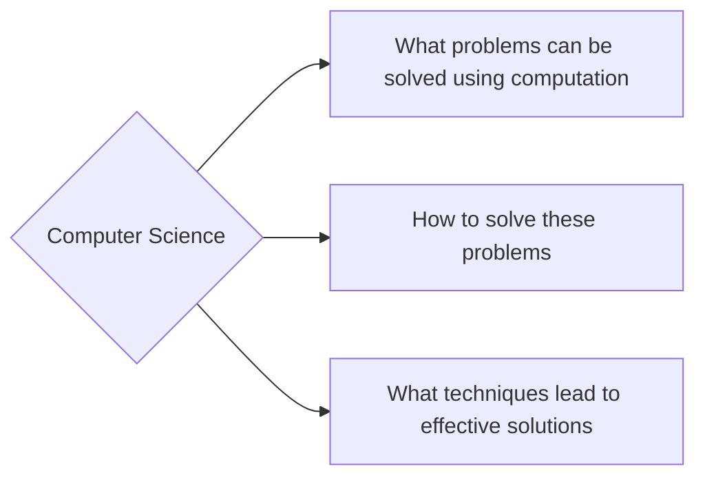

# CS 111
Canvas and https://cs111.cs.byu.edu

[Syllabus](https://cs111.cs.byu.edu/articles/about/)

Shouldn't be anything difficult. More time management for myself than anything

CS61A == CS 111

Course topics:
- Complexity
- Programing concepts
- How computers interpret computer programs
- Different languages (Regex, BNF, Scheme)
- Problem solving techniques (both iterative and recursive approaches)

Course components
- Lectures (*learn* code)
- labs (write code doing homework, so less workload)
- discussions
- homework
- projects
- exams (interpret code)
- textbook
- office hours

Homework starts Tuesday and the projects are due Friday (typically)

## **Archive of previous tests!!!**

There is discord, slack, etc. 

# Phil 110 
[Syllabus](https://learningsuite.byu.edu/.og2-/cid-5TJj1DjnK2DK/student/syllabus/instructor_ta)

Divided by topic

email: brandonhbn@yahoo.com
office location: JKB 4020
Office hours: 11am-12pm

| Grade | Percent |
| ----- | ------- |
| A     | 93%     |
| A-    | 90%     |
| B+    | 87%     |
| B     | 83%     |

grades based on performance *only*

late work is **not** accepted

The Norton introduction to philosophy second edition

Attendance affects your letter grade.

# Psych 111

Time spent on tying Gospel truth into Psychology

TAs: Emily and Michael

Same material in the online quizzes as in the actual exams.

Study guides on Learning Suite for **all tests**

Read the text *prior* to coming to lectures

1000 points total:
- Exams are 400 points
- Papers are 150 points
- Quizzes are 200 points
	- Two lowest scores are **dropped**
- Participation is 100 points
- Final Exam is 100 points
- Experimental Participation 50 points

# Physics 121

Describing Contact forces and gravitational forces

# BOM

- Initial study of attributes outline
- Sylybus quiz
- attendence, reading, stuffs.

